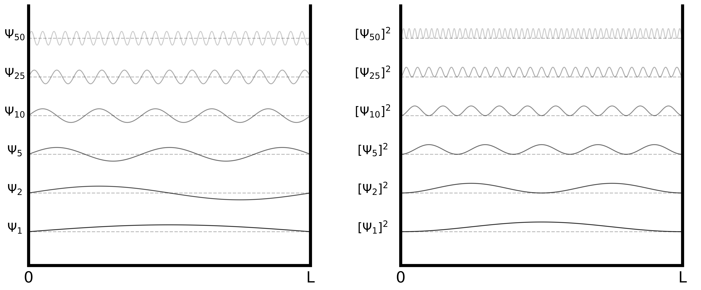
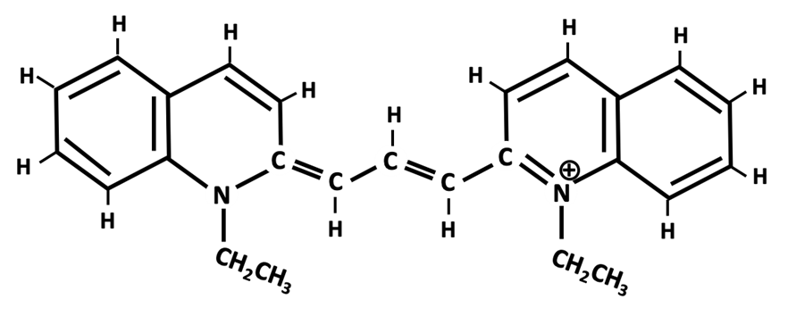
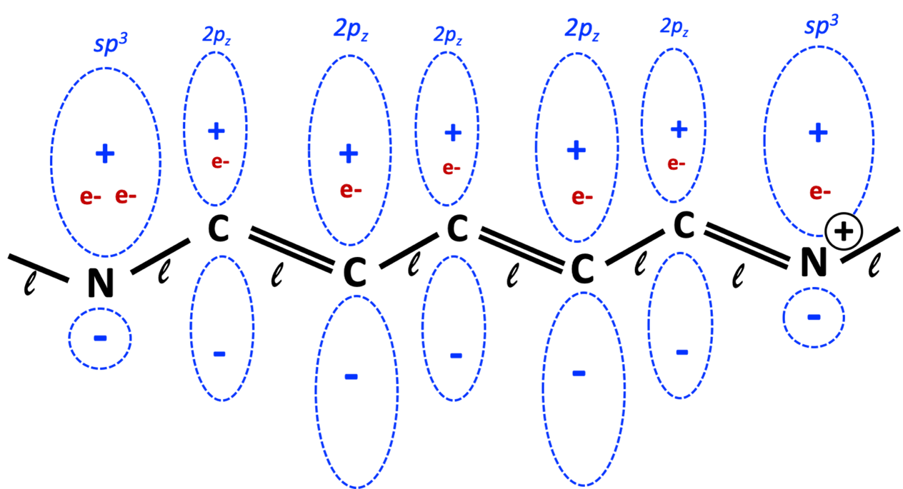
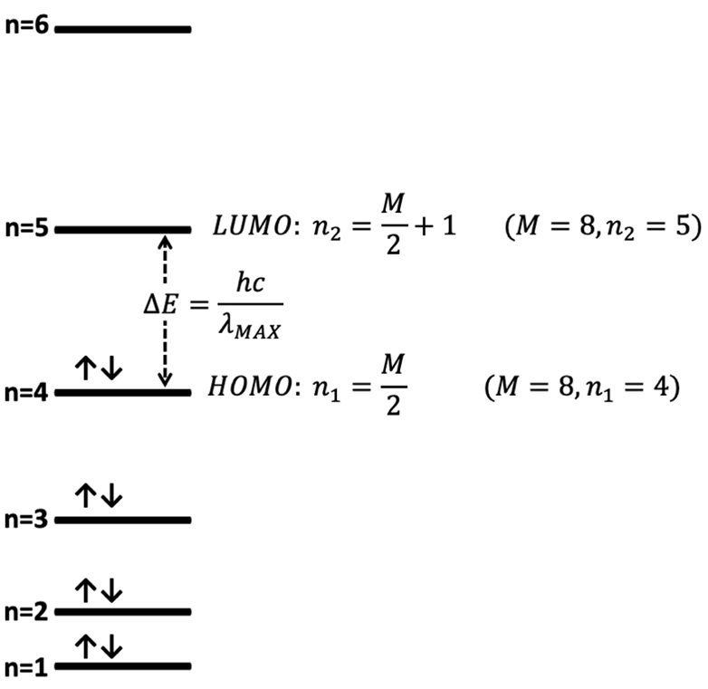
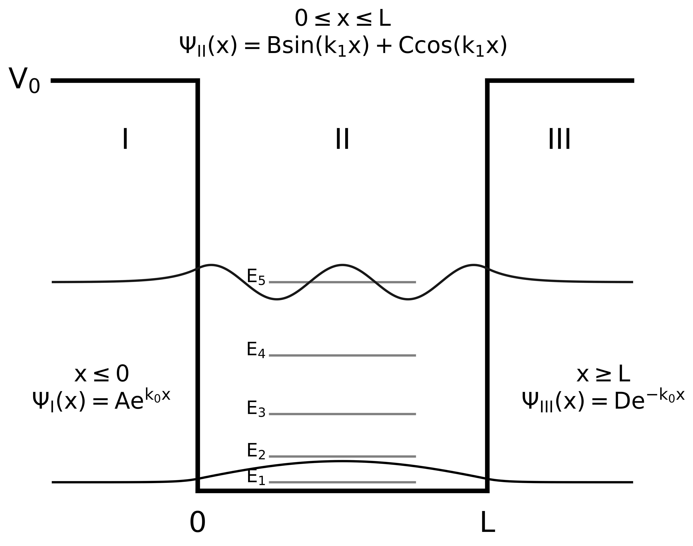

# ABSORPTION SPECTRA OF CONJUGATED DYES

> [!NOTE]
> Particle-in-a-box
> 
> HOMO/LUMO of conjugated dyes
> 
> Computational Chemistry (TDDFT)
> 
> Data Analysis and Visualization
> 
> Molecular Orbital Analysis
> 
> Finite Well

## Quantum Theory Background

### Particle in a Box

**6.1.** V(x), Ψ(x) and Ψ2(x) for the particle in the box solutions.

The quantum mechanical problem of describing the motion of a particle confined in a one-dimensional box is the first problem encountered as we begin to wade into modern atomic and molecular theory in the first semester of Physical Chemistry. Mathematically, the particle-in-a-box (PIB) model illustrates key features of quantum theory with respect to translational motion, e.g., eigenfunctions and eigenvalues, operators, and the non-classical concepts of zero-point energy, charge localization, and quantization of energy. In the PIB model, a particle is confined to moving in the x-dimension of a box of length $L$. Inside the box, the potential, $V(x)$, is zero while outside the box, $V(x)$ is infinite (Figure [6.1](#Fig6-1-PIB)).[^1]

Schrödinger's time-independent equation for a particle confined to move in one dimension (along the $x$-axis) is:

$$
-\dfrac{\hbar^2}{2m_e} \dfrac{d^2}{dx^2} \Psi(x) + V(x)\Psi(x) = E\Psi(x)
$$

For an infinite potential well extending from $x = 0$ to $x = L$, the potential energy function is defined as:

$$
V(x) =
\begin{cases}
0, & 0 < x < L \\
\infty, & x \leq 0 \text{ or } x \geq L
\end{cases}
$$

In this case, the wavefunction $\Psi(x)$ must be zero outside the well due to the infinite potential barrier, meaning the particle has zero probability of being found outside the box. Inside the well, where $V(x) = 0$, Schrödinger's equation reduces to:

$$
-\dfrac{\hbar^2}{2m} \dfrac{d^2}{dx^2} \Psi_n(x) = E_n \Psi_n(x)
$$

Solving this second-order ordinary differential equation with boundary conditions $\Psi(0) = \Psi(L) = 0$ gives the normalized eigenfunctions and quantized energy levels ($n = 1, 2, 3, \ldots$):

$$
\begin{align}
\Psi_n(x) &= \sqrt{\dfrac{2}{L}} \sin\left( \dfrac{n\pi x}{L} \right)  \\
E_n &= \dfrac{n^2 h^2}{8mL^2} \end{align}
$$

Far from being only a pedagogical and mathematical exercise, confining a particle to moving in a 1D box has applications in predicting properties of dye molecules that can be measured. The energy levels predicted by solutions to the 1D PIB problem may be used to predict the maximum absorption wavelength, $\lambda_\text{max}$, for some chemical compounds that absorb light in the visible spectrum. Such compounds generally have delocalized electrons from either the $\pi$ electrons in a conjugated organic molecule or the odd electron in a free radical species. In this experiment, $\lambda_\text{max}$ will be determined for several conjugated dye molecules (having the general form shown in Figure [6.2](#Fig6-2-Dyes)) that absorb in the visible part of the spectrum. The measurements will be compared to predictions of $\lambda_\text{max}$ by Equation [6.4](#Eq6-4-Energy) as manipulated below. This approach is referred to in the literature as the "free-electron model."[^2]

**6.2.** A conjugated dye compound with five carbons in the forming the π-electron backbone

**6.3.** The atomic orbitals forming the π-electron backbone in a conjugated dye compound with five (5) carbons.

The $\lambda_\text{max}$ of the visible spectrum may be approximated as transitions of the $\pi$ electrons between the *HOMO* (**H**ighest **O**ccupied **M**olecular **O**rbital) and the *LUMO* (**L**owest **U**noccupied **M**olecular **O**rbital) as defined in Equation [6.4](#Eq6-4-Energy). Referring to Figure [6.3](#Fig6-3-Pisystem), each carbon atom in the $\pi$-electron backbone contributes one (1) electron, the nitrogen at the left boundary contributes two electrons (sp$^3$), and the nitrogen on the right boundary (ionized) contributes one more. Thus, the total number of electrons ($M$) populating the $\pi$-molecular orbitals is given by Equation [6.5](#Eq6-5-TotalElectrons) where $p$ is the number of carbon atoms in the $\pi$-electron backbone. 

$$
M=p+3
$$

For a molecule with $M$ electrons in the conjugated system, using the standard building-up (Aufbau) principle, the $M/2$ lowest energy levels will be filled in the ground state (see Figure 6.4). The absorption of light is associated with the transition from the HOMO ($n_1 = M/2$) to the LUMO ($n_2 = M/2 + 1$) is $\Delta E$ defined in Equations [6.6](#Eq6-6-DeltaE)-[6.8](#Eq6-8-DeltaE). 

$$
\begin{align}
E_2-V-(E_1-V)=\Delta E&=\dfrac{h^2}{8m_e L^2}\times(n_2^2-n_1^2) \\
(n_2^2-n_1^2)=\bigg(\dfrac{M}{2}+1\bigg)^2-\bigg(\dfrac{M}{2}\bigg)^2&=\dfrac{M^2}{4}+M+1-\dfrac{M^2}{4}=M+1 \\
\Delta E&=\dfrac{h^2}{8m_e L^2 }\times(M+1) \end{align}
$$

**6.4.** The "building up" of the molecular energy levels for a conjugated dye compound with five (5) carbons and therefore M=8 electrons.

It is assumed that the potential energy, $V(x)$, is constant along the $\pi$-electron backbone, and that it rises sharply to the infinity at the ends. To determine the length, $L$ of the approximated one-dimensional "box," refer again to Figure [6.3](#Fig6-3-Pisystem). As a simplifying assumption, the average C-C and C-N bond distance is designated $l$. For a conjugated dye compound with $p$ carbon atoms, there are $p-1$ C-C bonds, two C-N bonds, and an additional length of one bond length on either side of the nitrogen atoms.[^3] 

$$
L = (p-1+2+2)l = (p+3)l
$$

 Substituting Equations [6.9](#Eq6-9-L) and [6.5](#Eq6-5-TotalElectrons) into Equation [6.8](#Eq6-8-DeltaE), we have the working equations for $\Delta E$ and $\lambda_\text{max}$ in terms of known constants and $p$, the number of carbons in the $\pi$-electron conjugated backbone. The literature value of the average bond distance, $l$, is 1.39 $\angstrom$.[^4] 

$$
\begin{align}
\Delta E&=\dfrac{h^2 (p+4)}{8m_e l^2 (p+3)^2} \\
\lambda_\text{max}&=\dfrac{8m_e cl^2 (p+3)^2}{h(p+4)}  
\end{align}
$$

### Computational Chemistry

r\[0pt\]0.6 {width="60%"}

Computational chemistry has advanced with the digital age, offering critical insight into chemical processes and properties that are difficult to measure experimentally. The seminal work of chemists, mathematicians, and physicists such as Erwin Schrödinger and Douglas R. Hartree, as well as Chemistry Nobel Laureates John Pople and Walter Kohn, throughout the 20th century constructed the foundation of computational chemistry long before the digital age began. In the context of the PIB experiment, calculating absorption spectra previously have utilized faster, semiempirical methods using the configuration interaction singles (CIS) method to calculate absorption spectra. However, excited state methods like time-dependent density functional theory (TDDFT) are more common to compute absorption spectra with greater accuracy.[6.10](#Fig6-10-PIBexample) shows how the 1D PIB framework maps onto (3E, 5E, 7E)-1,3,5,7,9-decapentaene. Computed molecular orbitals (MOs) visually encode the same nodal behavior and energy spacing consistent with the PIB model, illustrating how computational tools can bridge fundamental quantum models with observable molecular behavior. For a more detailed overview of computational chemistry, see Lab [11](#Lab11-CompChem).

l\[0pt\]0.6 {width="60%"}

Density functional theory (DFT) originates from the Hohenberg-Kohn theorems in 1964, an existence proof that proved that the charge density ($\rho [r]$) completely determines the electronic properties of the ground state including energy. The implementation of DFT is the development of numerous functionals that approximate the relationship between electron exchange and correlation and comes in numerous flavors, which makes picking a functional to use like darts on a dartboard---hoping to hit a bulls-eye for accuracy to experiment.

While TDDFT effectively models absorption spectra qualitatively, quantitative accuracy decreases at higher energy core-valence excitations, with errors ranging from 30-100 eV compared to typical UV-vis errors of 0.2 to 0.5 eV, largely depending on the chosen functional. To correct this underestimation, linear shifts (shifting absorption energies by the mean absolute error) and linear transformations (shifting the absorption energies via the best fit line between computed and experimental absorption energies) are techniques employed to show how TDDFT correctly predicted the lineshape of the spectra (Figure [6.7](#Fig6-7-Example)).[^6] Range-separated hybrid functionals like CAM-B3LYP and $\omega$B97X-D3 are particularly suited for absorption spectroscopy. This tier of functionals treats long-range electron interactions with a variable rate of exact exchange by correcting errors associated with vertical transition methods for absorption.

r\[0pt\]0.4 {width="40%"}

A use case for computed UV-Vis spectra is the prediction of the structure, spectroscopy, and formation mechanisms of aerosols. Coordination spheres consisting of solvent or other atmospheric gas phase particles present in the atmosphere at night can be used to simulate more realistic conditions. This example consisted of and radicals coordinated to monoterpenes. The figure on the right was contributed by Bianca Aridjis-Olivos (B.S. Chemistry '23).

### Particle in a Finite Well

The finite well model (Figure [6.9](#Fig6-9-PIBFinite)) extends the 1D infinite potential well (Figure [6.1](#Fig6-1-PIB)) by introducing finite barriers, allowing for quantum tunneling and wavefunctions that decay into the barrier regions. This results in lower, more closely spaced energy levels and offers a more realistic approximation of electron behavior in molecules. Computational chemistry techniques reinforce this connection by visualizing MOs of the 3D geometry (Figure [6.10](#Fig6-10-PIBexample)), which leads to an estimation of the effective box length and well depth. Rendering MOs in the context of a finite well also helps illustrate how the well depth limits the number of bound states, highlighting where the particle-in-a-box approximation breaks down and higher energy orbitals begin to resemble unbound or delocalized states. By combining these computational insights with the finite well model, we will use the finite well approximation as a predictive tool for absorption spectra. Figure [6.9](#Fig6-9-PIBFinite) shows the general solutions to the wavefunctions within each region (I, II, and III).

**6.9.** Schematic and Wavefunction for the particle in a finite well model.

Consider a particle in a finite well model where 

$$
\begin{align}
k_0 &= \sqrt{\dfrac{2m_e}{\hbar}(V_0-E)}\\
k_1 &= \sqrt{\dfrac{2m_eE}{\hbar^2}}
\end{align}
$$

To determine the energy eigenvalues from the wavefunction, we begin the derivation where $\Psi_\text{I}(x)$ and $\Psi_\text{II}(x)$ must follow the boundary conditions at x=0, i.e., $\Psi_\text{I}(0)=\Psi_\text{II}(0)$ and $\Psi'_\text{I}(0)=\Psi'_\text{II}(0)$. 

$$
\begin{align}
Ae^{k_0(0)} &= Bsin(k_1*0)+Ccos(k_1*0)\\
Ak_0e^{k_0(0)} &= Bk_1cos(k_1*0)-Ck_1sin(k_1*0)\end{align}
$$

By solving the system of Equations [6.15](#Eq6-15-Psi1-0) and [6.16](#Eq6-16-Psi2-0), 

$$
\begin{align}
C&=A\\
B&=A\frac{k_0}{k_1}\end{align}
$$

At x=L, the system of equations containing $\Psi(L)$ and $\Psi'(L)$ is 

$$
\begin{align}
De^{-k_0L} &= Bsin(k_1L)+Ccos(k_1L) \\
De^{-k_0L} &= Bk_1cos(k_1L)-Ck_1sin(k_1L)\end{align}
$$

 By multiplying Equation [6.19](#Eq6-19-Psi2-L) by $k_0$ and using Equations [6.17](#Eq6-17-C) and [6.18](#Eq6-18-B), 

$$
\begin{align}
Dk_0e^{-k_0L} &= A\dfrac{k_0^2}{k_1}sin(k_1L)+Ak_0cos(k_1L) \\
Dk_0e^{-k_0L} &= -A\dfrac{k_0}{k_1}k_1cos(k_1L)+Ak_1sin(k_1L))\end{align}
$$

 By equality, Equations [6.21](#Eq6-21-Psi2-L) and [6.22](#Eq6-22-Psi3-L) may be solved for the quantity $Dk_0e^{-k_0L}$ 

$$
\begin{align*}
\dfrac{k_0^2}{k_1}sin(k_1L)+k_0cos(k_1L) &= -k_0cos(k_1L)+k_1sin(k_1L)\\
k_0^2sin(k_1L)+k_1k_0cos(k_1L) &= -k_1k_0cos(k_1L)+k_1^2sin(k_1L)\\
2k_1k_0cos(k_1L) &= (k_1^2-k_0^2)sin(k_1L)
\end{align*}
$$

 

$$
2k_1k_0 = (k_1^2-k_0^2)tan(k_1L)
$$

 By substituting $k_0$ and $k_1$ into Equation [6.23](#Eq6-23-FE), 

$$
2\bigg(\dfrac{2m_eE}{\hbar^2}\bigg)\sqrt{E(V_0-E)} = \bigg(\dfrac{2m_eE}{\hbar^2}-\dfrac{2m_e(V_0-E)}{\hbar^2}\bigg)tan\bigg(\sqrt{\dfrac{2m_eEL^2}{\hbar^2}}\bigg)
$$

 

$$
\dfrac{2\sqrt{E(V_0-E)}}{2E-V_0} = tan\bigg(\sqrt{\dfrac{2m_eEL^2}{\hbar^2}}\bigg) 
$$

 The values of $E$ where the two quantities in Equation [6.24](#Eq6-24-FE) are equal correspond to the energy levels of the finite well. These functions can be plotted in Python to determine the allowed values of $E$ for a given potential depth $V_0$ and box length $L$ by solving the roots. The fsolve function in Python is useful for this purpose, but any equivalent numerical root solver in Excel would suffice. For this experiment, $V_0$ is determined by finding the range of orbital energies containing the $\pi$ orbitals of the conjugated region inside the box. More details on doing this analysis will be provided in the next section. From there, the wavelength of the $\pi$-$\pi^*$ transition can be calculated.

## Procedure

### Computational

You do not need your safety goggles for the computational portion of the experiment.

#### STEP 1. Build the molecules

For 1,1'-diethyl-2,2'-cyanine iodide, 1,1'-diethyl-2,2'-carbocyanine chloride, and 1,1'-diethyl-2,2'- dicarbocyanine iodide, build a three-dimensional representation in Avogadro or Chemcraft and optimize the structure using the AutoOptimization tool or a symmetry feature, respectively. Set the force field to UFF if it is not there by default. Once the optimization is complete, save the file in the xyz format. This will be the 3D structure that will be used in the calculations. Normally, we would use a more sophisticated method to get the optimized 3D geometry of the molecule, but due to time, this structure optimized with UFF will suffice as the major structural parameters of the current structure is close enough to a 3D geometry optimized with DFT.

#### STEP 2. Build the input files

Use the ORCA file template below to insert the xyz coordinates into the file using a notepad editor. Do not copy the first two lines that include the number of atoms and the title generated.

> [!IMPORTANT]
> \# Arbitrary Title\
> RIJCOSX CAM-B3LYP def2-SVP def2-SVP/C TightSCF LargePrint PrintBasis\
> %pal nprocs 12 end\
> %MaxCore 2000\
> %tddft\
> NRoots 20\
> MaxDim 5\
> TPrint 0.1\
> end\
> %cpcm smd true\
> smdsolvent \"methanol\"\
> end\
> xyz 1 1\
> \# **XYZ coordinates go here**\
> C 0.000 0.000 0.000 \# (Example of what goes here -- do not actually use this line)\
> \...\

Make sure the file extension is set to **.inp**.

#### STEP 3. Submitting jobs on the PC

> [!IMPORTANT]
> Underscores and dashes are a better tool than spaces for naming files and directories in Unix.

Make sure all the input files are on one of the workstation computers. Copy the three bash scripts to the folder with the input files (dye.inp). These scripts are **mkdir.sh**, **submit.sh**, and **spectra.sh**. Transfer your files to the Linux workstation. Open the terminal window in your respective folder.

> [!IMPORTANT]
> You can use the tab key to autocomplete typing in a terminal window.

Once completed, run the scripts on the local PC by typing by typing in the following 

$$
\begin{align*}
&\text{./mkdir.sh} \\
&\text{./submit.sh}
\end{align*}
$$

These jobs will take approximately 30-45 minutes to complete. In the meantime, collect the experimental UV-Vis spectra.

### Experimental

The Perkin-Elmer Lambda 365 UV-VIS spectrophotometer will be used to take the spectra from each of three dyes in this laboratory. 10$^{-3}$ M solutions of **1,1'-diethyl-2,2'-cyanine iodide**, **1,1'-diethyl-2,2'-carbocyanine chloride**, and **1,1'-diethyl-2,2'- dicarbocyanine iodide** dyes will be provided.

#### STEP 4. Set up the UV-Vis

For each of the of the three dyes, scan the visible spectrum in the region 300-800 nm to find the wavelength of maximum absorption, $\lambda_\text{max}$.

#### STEP 5. Collect the absorption spectra

Dilute the initial solution with methanol until the peak absorbency is about 1.0 or slightly less ($\le$1 absorption will cause a saturated signal and large errors in determining $\lambda_\text{max}$). Use only a few drops of the dye from a disposable pipette and then dilute with methanol. Record the $\lambda_\text{max}$ for each scan. If the scan is not at a sufficient resolution, use an interpolation function to create a spectra with more curvature. Export the data files as csv (Comma separated values) files so you can plot the data in Excel/Python for inclusion in the formal lab report. Estimate $\Delta_{95}\lambda$.

### Analyze the Computational Data

#### STEP 6. Generate Data Files

Once your job is finished, you should see a file with a *.out* extension and a *.cis* extension. Output (*.out*) and CIS (*.cis*) files contain ****A LOT**** of information, which requires one to know what information they need. Use the pre-made extraction script (**spectra.sh**) to extract the relevant information from the TDDFT calculation by typing the following in the terminal window: 

$$
\begin{align*}
&\text{./spectra.sh}
\end{align*}
$$

 This will create a *.csv* file with the information you need to plot the spectra in Python using Equation [6.14](#Eq6-14-UVVis). This will count as the raw data for the computed spectra, therefore, you need to either provide a printout, or create a table (below) in your notebook. There will be 20 rows since there are 20 states that you calculated.

   $\lambda$ (nm)   $f$ (a.u.)
  ---------------- ------------
                   
                   
                   
                   
                   

Transfer all contents of the folder to your flash drive preferably to wherever you are storing your data for this lab.

> [!IMPORTANT]
> $\Delta_{95}$ calculations are not common for computational results as the same structure with the same parameters in the same program will yield the same results up to numerical precision. When converting from the default unit ($E_h$) to a more common energy unit (kJ/mol, kcal/mol, eV, etc.), the changes are negligible when the energy converges to $\sim$10$^{-10} E_h$, and thus uncertainty is not typically reported for a single measurement.

#### STEP 7. Analyze Data

Analyze the output files by opening the output file (\*.out) in Chemcraft. Right-click and open the same output file with Notepad++. On the Notepad++ window, scroll to the bottom of the output file. Then start scrolling up until you hit a section called TRANSITIONS. For STATE 1, find the line where it says XXa $\rightarrow$ YYa. The coefficient shown on the right represents the **c$^2$** coefficient we have seen in class, indicating the highest weighted transition, i.e., the dominant contribution.

In ChemCraft, open the Tools $\rightarrow$ Orbitals $\rightarrow$ Render molecular orbitals tool. With your identified orbital numbers, click the orbital numbers that correspond to the MOs identified in the text file. Note that ORCA starts counting at 0 while ChemCraft starts at 1.

Save images (File $\rightarrow$ Save as $\rightarrow$ Save image) of the molecular orbitals. Play around with the isovalue/contour value (0.03 to 0.1) and the color. **What happens to the size of the molecular orbitals as you increase/decrease the isovalue?** Feel free to rotate the molecule to adjust the zoom and isovalue to get the right angle. These will be used as part of a figure and as part of the discussion.

The extracted results from the ORCA calculations contain information about the excitation wavelength ($\lambda$) and the oscillator strength ($f$). You will need to broaden each transition using Equation [6.13](#Eq6-13-UV-Vis-Plot),

$$
\varepsilon_i(\lambda)=\num{1.3062974e8}\dfrac{f_i}{\sigma} \text{exp}\bigg[-\bigg(\dfrac{1/\lambda-1/\lambda_i}{\sigma}\bigg)^2\bigg] 
$$

where $i$ represents the $i^\text{th}$ electronic excitation, $\lambda$ is the excitation wavelength in nm, $f_i$ is the oscillator strength (a.u.), and $\sigma$ is the parameter for peak broadening. Setting $\sigma$ = 0.2 eV = 1/6199.2 nm$^{-1}$ = 10$^{7}$/6199.2 cm$^{-1}$ will result in the following reduction

$$
\varepsilon_i(\lambda)=\num{1.3062974e8}\dfrac{f_i}{10^{7}/6199.2} \text{exp}\bigg[-\bigg(\dfrac{1/\lambda-1/\lambda_i}{1/6199.2}\bigg)^2\bigg]
$$

Equation [6.14](#Eq6-14-UVVis) covers how to broaden a singular excitation. The overall spectrum will come from the sum of all the individual excitations. 

$$
\varepsilon(\lambda)=\sum_{i=1}^{n}\varepsilon_i(\lambda)=\sum_{i=1}^{n}\bigg(\num{1.3062974e8}\dfrac{f_i}{10^{7}/6199.2} \text{exp}\bigg[-\bigg(\dfrac{1/\lambda-1/\lambda_i}{1/6199.2}\bigg)^2\bigg]\bigg)
$$

 where $n$ is the number of states you calculated (in this case, NStates=20). You will need to use Equation [6.15](#Eq6-15-UVVis) to generate a computed spectra. In Equation [6.15](#Eq6-15-UVVis), your wavelengths ($\lambda$) are the x-values and $\lambda_i$ is the computed wavelength corresponding to the transition with oscillator strength $f_i$. Some molecular visualization programs like GaussView and Avogadro can plot the UV-Vis absorption spectra; however, you will need to combine the experimental and computational spectra into a single plot for your analysis. These programs will generate a separate image for the spectra but not the data points needed in order to combine the plots together. This is where using data analysis tools within Python could be more efficient than Excel. Plotting the results in the same figure can better show the overlaps between computed and experimental spectra, leading to insights about the chemistry occurring at an excitation wavelength. Since this formula yields the molar absorptivity coefficients ($\varepsilon$) in units of L mol$^{-1}$ cm$^{-1}$, multiply the results of Equation [6.14](#Eq6-14-UVVis) by the concentration (M) of the sample. If the length $l$ of the cuvette in cm is known, multiply by the length $l$ of the cuvette, otherwise, assume a length of 1 cm (you would multiply the $\varepsilon$ by 1). This will give you a calculated absorbance that you can more readily compare to the experimental spectra.

r0.65 {width="65%"}

You can plot these on a two-axis plot (two separate y-axes plotted against a singular x-axis) with **Calculated Absorbance (a.u)** on the first axis and **Normalized Absorbance (a.u.)** on the second axis (Figures [6.7](#Fig6-7-Example) and [6.6](#Fig6-6-Example)). The extracted text file with the results gives a set of ordered pairs ($\lambda$, $f$) that are also represented as vertical lines on a computed spectra. You don't want the transitions to overshadow the peaks, so scale the oscillator strengths $f$ based on the maximum calculated absorbance and include these as part of the computed spectra. Make sure the top of the vertical line appears below the maximum calculated absorbance. Using vertical lines indicate the exact calculated wavelength of the excitation. Theoretically, if line broadening was not an issue, all spectra would be a series of vertical lines. Here is the tutorial going into more detail on Equations [6.13](#Eq6-13-UV-Vis-Plot)-[6.15](#Eq6-15-UVVis): [How to plot UV-Vis spectra from Gaussian](https://gaussian.com/uvvisplot/)

Examples [Prop6-1:Vlines](#Prop6-1-Vlines) and [Prop6-2:Spec](#Prop6-2-Spec) show the Python code used to make Figure [6.6](#Fig6-6-Example). This uses a two-axis plot to compare the experimental spectra to the theoretical/computed spectra. The *vlines* function creates vertical lines. This is useful to identify the transitions obtained via theoretical spectra, as these are the centers for broadening, which can shift the peak location based on the density of states. Scaling of these lines is arbitrary as it is more for a visual aid and qualitative assessment of the ratios between transition energies rather than a quantitative analysis.

### Theoretical

#### STEP 8. Use the finite well model

Equation [6.24](#Eq6-24-FE) has been coded into Python for you to identify the energy eigenvalues. You will need to specify the box length and the value for the potential $V_0$. The box length will be the calculated distance from the theoretical \"free-electron\" model. The potential $V_0$ will be calculated using the orbital energy eigenvalues. The orbital energy eigenvalues are computed by diagonalizing the Slater Determinant. Open the output file in a text editor and find the \"ORBITAL ENERGIES\" section. Identify the orbitals that correspond to the lowest energy conjugated $\pi$ orbitals on the region within the well. Grab the energy of this orbital and the LUMO. This will represent the well depth. Since both values are negative, you will add these values together and then take the absolute value to compute $V_0$. You will be responsible for reading and interpreting how this code operates while using the output of the code to compute the wavelength of the corresponding transition $\lambda_{MAX}$. A discussion of this numerical process will need to be included in the formal report.

## Required Elements for the Lab Report

**This is a group lab report.** Every group member will need to be involved in constructing the figures and answering discussion questions.

### Tables and Calculations

1.  Include a table for the required dilutions for each dye to obtain a well-scaled spectrum. (**Procedure**)

2.  Report how you determined or estimated $\Delta_{95}\lambda$. No propagation of errors is required in this lab because the $\lambda_\text{max}$ is not used in a calculation, but it still needs to have a quantified precision. (**Results and Discussion**)

3.  Include a table in it with the name, chemical formula, $p$, $M$, *theoretical* $\lambda_\text{max}$ (Infinite Well), *theoretical* $\lambda_\text{max}$ (Finite Well), *computed* $\lambda_\text{max}$, and *experimental* $\lambda_\text{max} \pm \Delta_{95}\lambda$ (**Results and Discussion**)

### Figures

1.  You should have a total of six spectra: for each of three dyes there will be one experimental spectrum and one broadened computed spectra. Properly label the figures for reference in the text. Each group member should be responsible for creating the figures for the dye that they constructed. How you choose to combine them is up to you. (**Appendix**)

2.  A schematic with the energy levels of the finite well model for each dye using the box length you calculated and the $V_0$ obtained from the MO analysis (**Appendix**). A representative schematic for one dye can be placed in the **Results and Discussion** section.

3.  Create an overlap graph between computed and experimental spectra on a two-axis plot. (**Results and Discussion**)

    1.  This can additionally be a three-part one-column figure where each dye is a separate plot (a 3 row, 1 column subplot) if the version with all three dyes is placed in the Appendix. Each group member should contribute to making this figure.

    2.  Include the transition energies ($\lambda$, $f$) as vertical lines.

    3.  Include an inset figure that showcases the orbitals involved in the transition at $\lambda_\text{max}$.

    4.  Your figure should emulate either Figure [6.7](#Fig6-7-Example) or [6.6](#Fig6-6-Example). Whichever you choose, make sure to justify your reasoning.

    5.  While it is possible to create the figure in a single program, you may use separate programs to create the plot and inset figure, e.g., Excel/Python and PowerPoint, based on what you think is the best use of your time and how you want to construct the figure.

### Discussion Questions

1.  Based on your experimental results, make a general statement about the accuracy of the free-electron model. Include a table containing the theoretical $\lambda_\text{max}$ from the free-electron model, the theoretical $\lambda_{MAX}$ from the finite well, the computed $\lambda_\text{max}$ from TDDFT, and the experimental $\lambda_\text{max}$. Include the $\Delta_{95}\lambda$ and %-error calculated by Equation [6.12](#Eq6-12-PercentError).

    

$$
\text{ error}=\left|\frac{\text{theoretical}\ \lambda_\text{max}-\text{experimental}\ \lambda_\text{max}}{\text{theoretical}\ \lambda_\text{max}}\right|\times100
$$

2.  Discuss sources of systematic error that might give rise to the % error in $\lambda_\text{max}$ that you observe. Use the resources provided in Brightspace (and footnoted herein) for this discussion. Proper citation is required.

3.  As discussed in class, the finite well model is the next step in complexity from the PIB model. How does the finite well PIB model correspond to the conjugated dyes? What is the effect of well depth on the calculated absorbance wavelengths? Did using the finite well model improve your results from the theoretical $\lambda_\text{max}$ calculated from the infinite well?

    1.  How did the Python code used for the finite well model work? What did the code do? These two questions can go into the **Procedure** section if the text flows better there.

4.  Based on your spectra, account for the observed colors of the dyes.

5.  Which orbitals were responsible for the transition that corresponds to $\lambda_\text{max}$?

6.  Are there other features in your experimental spectra that the TDDFT results can identify? If so, how would you go about identifying those?

7.  What causes peak broadening in spectroscopy? Why do computed spectra return vertical lines rather than a broad spectra? *Hint: Consider Heisenberg's Uncertainty Principle and the chapters on spectroscopy (covered in CHE 3332).*

## Pre-Lab Assignments/Quizzes (5 pts each)

**COMPLETE ALL PRE-LAB ASSIGNMENTS/ QUIZZES BEFORE COMING TO LAB**\

### Experimental Pre-lab Quiz (5 pts)

Show all your work in your lab notebook clearly marked as "PRELAB WORK"\

Make a clear beginning in the notebook for Lab [6](#Lab6-PIB). Use this space to work through equations [6.6](#Eq6-6-DeltaE) through [6.11](#Eq6-11-LambdaMax) to make sure you have a firm grasp on how $\lambda_\text{max}$ is estimated from the framework of the energies predicted by the solutions to particle-in-a-box problem. Answer these questions on the Pre-lab worksheet and add to your notebook.

1.  Determine $p$ and $M$ for each dye listed in the Procedure section. Obtain chemical formulae and chemical structure for each and enter them into your notebook. A useful source for information on the dyes is [Sigma Aldrich](https://www.sigmaaldrich.com/catalog/product/aldrich/).

2.  Use Equation [6.11](#Eq6-11-LambdaMax) to calculate the theoretical $\lambda_\text{max}$ from the free-electron model. Your notebook should have a table in it with the name, chemical formula, $p$, $M$, and *theoretical* $\lambda_\text{max}$. Keep a blank column in reserve for your *experimental* $\lambda_\text{max}$.

3.  Find the references for CAM-B3LYP, def2-SVP, SMD solvation model, and ORCA 6. List them in ACS format in your notebook. *Hint: These are highly cited articles.*

### Python Analysis Pre-Lab Assignment (5 pts)

You will need to download the Rotation 4 pre-lab Jupyter Notebook from Brightspace. Then upload the .ipynb file to your Google Drive and open it in Google Colab. Once the assignment is completed, you will submit the notebook to Brightspace as your assignment submission. This pre-lab assignment focuses on techniques you will use for data analysis related to this lab.

You will use Equation [6.15](#Eq6-15-UVVis) and Example [Prop6-2:Spec](#Prop6-2-Spec) to create a computationally broadened spectra for a 2E-5 M solution of a dye-like molecule with the information provided below. Include the vertical lines that will correspond to these transitions.

   $\lambda$ (nm)    $f$
  ---------------- --------
       560.12       2.5769
       500.17       0.0035
       450.74       0.4934
       345.56       0.0657
       323.45       0.0063

## Lab Notebook Grading Rubric (20 pts)

**YOU WILL HAVE ONE WEEK FROM THE COMPLETION OF THE DATA COLLECTION TO TURN IN YOUR NOTEBOOK**\

1.  (**2 pts**) Laboratory notebook set-up

    1.  Notebook labeling

    2.  Table of contents

    3.  Page numbering

    4.  Use of ink

2.  (**8 pts**) Laboratory work

    1.  Neat and organized.

    2.  All data collected in the lab contained in the notebook.

    3.  Each page signed and dated.

    4.  Make sure that you reference your Excel data. This would just be the name of the file since folder structures can change. You do not need to provide your full file path.\

Leave space before you begin the section for a new lab as you will also need to take notes during the Python data analysis as you will have open lab notebook quizzes (and exams) over the Python code.

**YOU WILL GET FEEDBACK ON PYTHON NOTES BEFORE YOUR \"FINAL\"**\

1.  (**10 pts**) Notes for the Python-based lab exercises (pre-lab and in-class data analysis notebooks). Keep in mind that this is your reference, so follow the guidelines, but write and format this part in a style that makes sense to you.

    1.  Documentation and Reflection. Include the main objectives and some key points of doing these Python modules

    2.  Code accuracy of relevant Python syntax used for lab modules

    3.  Thoughts and personal observations while working through the in-class modules. Can include questions that you can address later.

    4.  Notes that clearly connect to data analysis done for the lab

    5.  Organization and Flow. All info written is contained in the notebook, so no loose leaf printouts. However, you can staple/glue a code printout if it helps you visualize Python better and saves time.

## Formal Report Grading Rubric

Submission Instructions: Submit to **Brightspace** as a PDF. Only one group member needs to do this.

m8cm\|X\|x1cm\|x2cm\| & Formal report \* 0.70 & 70 &\
& Lab notebook & 20 &\
& Assignments/ Quizzes & 10 &\
& Total & 100 &\

\|x3cm\|X\|x1.1cm\|x1.1cm\| Section & Key Points & Points & Grade\
ALL & Formatting & 10 &\
ALL & Spelling and Grammar & 5 &\
Abstract & Clarity and Completeness & 5 &\
& • Purpose, Background, References,& \*10 &\
&• Start with $E_n=\dfrac{h^2n^2}{8m_eL^2}$ (don't derive this) and discuss its relevance to absorption spectra of these conjugated systems. Also include finite wells.&&\
&• How computational chemistry, i.e., TDDFT, can be used to model UV-Vis absorption spectra.&&\
& • Equipment and procedure (computational as well) & \*15 &\
&• Flow (step-by-step)&&\
&• Table of amounts and types of each dye with dilutions&&\
&• How to determine $\lambda_\text{max}$ &&\
& • Table of data ($\lambda_\text{max}$ for each dye and method) (see instructions above)& \*10 &\
&• A figure in the main text like either Figure [6.7](#Fig6-7-Example) or [6.6](#Fig6-6-Example).&&\
& • What is the end goal? & \*20 &\
&• Include clear understanding of how $\Delta E$ and $\lambda_\text{max}$ are related to the number of carbons in the chain.&&\
& • Discuss each of the discussion questions on page & \*20 &\
&• Table of $\lambda_\text{max}$ (theory, exp, computed), $\Delta_{95}\lambda$, and %-error calculated by Equation [6.12](#Eq6-12-PercentError).&&\
Conclusion & Summary, next steps, suggestions & 5 &\
**Total** & & **100** &\

[^1]: Patel, P. In *Engaging Students in Physical Chemistry, Volume 2; ACS Symposium Series*; **2025**; 261–278.

[^2]: W. Jensen, O. Schmidt, J. Platt. "The Free-Electron Model," ACS Symposium Series; American Chemical Society (2013): 117-137.

[^3]: Hans Kuhn, "A Quantum-Mechanical Theory of Light Absorption of Organic Dyes and Similar Compounds", *J. Chem. Phys.*, **1949**, *17*, 12, 1198

[^4]: David P. Shoemaker, Carl W. Garland, and Joseph W. Nibler, Experiments in Physical Chemistry, 5th ed. (New York: McGraw-Hill, 1989), 442.

[^5]: Xu, J.; Kim, Y. L.; Khurana, R.; Havenridge, S.; Patel, P.; Liu, C. In *Ann. Rep. Comput. Chem.*; Wilson, A. K., Ed.; Elsevier, 2024; Vol. 20, pp 157–187. <https://doi.org/10.1016/bs.arcc.2024.10.006.>

[^6]: Patel, P. et al., *J. Phys. Chem. C.* **2022**, *126*, 11949-11962. <https://doi.org/10.1021/acs.jpcc.2c02049.>
